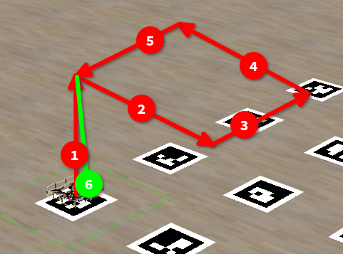

# 1. The SQUARE



This is first task in cloversim course, it shows basics of programming clover by creating a simple program that makes drone to:

1. Takeoff
1. Fly 1m positive x
1. Fly 1m positive y
1. Fly 1m negative x
1. Fly 1m negative y
1. Land

## Step-by-step tutorial

### Enable aruco map

This task provides aruco map on the ground to make flight more precise ([read more](https://clover.coex.tech/en/aruco_map.html)). To enable clover to use aruco map you need to:

1. Open `clover.launch` in editor (we will use `nano`)
   ```bash
   nano ~/catkin_ws/src/clover/clover/launch/clover.launch
   ```
2. Find arg that controls aruco, and enable it (change false to true). Like this:
   ```xml
   <arg name="aruco" default="true"/>
   ```
3. Save changes and exit nano (press `ctrl+x` then `y` then `enter`)
4. Now we need to enable aruco map and aruco detect, to do that let's open `aruco.launch`
   ```bash
   nano ~/catkin_ws/src/clover/clover/launch/aruco.launch
   ```
5. And enable args `aruco_detect` and `aruco_map` in it. Like this:
   ```xml
   <arg name="aruco_detect" default="true"/>
   <arg name="aruco_map" default="true"/>
   ```
6. Save changes and exit editor.
7. Now, because we changed clover configuration, we need to restart it. To do that press restart button in cloversim WebUI or cloversim IDE

### Connect to ros and clover services

Now with configured aruco map, we can start writing code to solve task. To control drone flight we need to communicate with over ROS clover node, so we will need to connect to ROS and create clover service proxies ([read more](https://clover.coex.tech/en/simple_offboard.html)). We also need to add convience function that will wait untill clover will arrive to its destination ([read more](https://clover.coex.tech/en/snippets.html)). So let's start.

1. First we need to create file where we are going to write code. Simplest way to do this is to use Cloversim IDE, open it from Cloversim WebUI, open folder (home folder will do fine) and create file named `solution.py` (or any other name you like)

2. Now import: `rospy` - communicate with ros; `clover.srv` and `std_srvs.srv` - types of different ros services; `math` - we need `math.sqrt` to calculate distance between points.

   ```py
   import rospy
   from clover import srv
   from std_srvs.srv import Trigger
   import math
   ```

3. Then we need to initialize ros node and create service proxies for clover services so we can call them ([read more](https://clover.coex.tech/en/simple_offboard.html)). We can do this like this:

   ```py
   rospy.init_node('flight')

   land = rospy.ServiceProxy('land', Trigger)
   get_telemetry = rospy.ServiceProxy('get_telemetry', srv.GetTelemetry)
   navigate = rospy.ServiceProxy('navigate', srv.Navigate)
   ```

4. Let's takeoff and then land, just to test that everything is right:

   ```py
   print("Taking off...", end='')
   navigate(frame_id='body', auto_arm=True, z=1)
   rospy.sleep(5)
   print(" success")

   # Land
   print("Landing...")
   land()
   ```

5. Run this program:

   ```bash
   python3 ./solution.py
   ```

   Drone should take off, get points for Point A, then clover should land and get points for landing (resulting score 20). Use reset simulator to move everything to initial state.

### Navigate and wait

When `navigate` is called clover starts to navigate to some point, but in most cases we also need to wait until it will arrive there. To do that let's write helper function that will navigate to some point and wait until clover arrives there. This function will also print in terminal current point we are flying to and distance to it. 
1. Our function will accept all arguments that `navigate` accepts, `tolerance` that specifies how close we except to clover be to target before we consider it arrived to point and also `point_name` which is current point name that we are flying to. The first thing function does is prints point we are flying to and then starting navigation to it:

   ```py
   def navigate_wait(point_name, x=0, y=0, z=0, 
                     yaw=float('nan'), speed=0.5, frame_id='',    
                     auto_arm=False, tolerance=0.1):

      print(f"Navigating to point {point_name}: Started", end='')
      
      navigate(x=x, y=y, z=z, yaw=yaw, speed=speed,
               frame_id=frame_id, auto_arm=auto_arm)
   ```
2. Now we will add loop that will run until distnace to destination is less than `tolerance`, create basic loop:
   ```py
   while not rospy.is_shutdown():
      rospy.sleep(0.2)
   ```
3. Then we should get clover telemetry relative to `navigate_target`. `navigate_target` frame is relative to the point we are navigating to, so for example if we are flying to `x = 1` (relative to map) and our current `x = 0` (relative to map), in telemetry `navigate_target` we will see `x = -1`.
   ```py
   telem = get_telemetry(frame_id='navigate_target')
   ```

4. Using Pythagorean theorem we convert distance in xyz axis to actual distance and print it
   ```py
   dist = math.sqrt(telem.x ** 2 + telem.y ** 2 + telem.z ** 2)
   print(f"\rNavigating to point {point_name}: distance={dist:.4f}  ", end='')
   ```

5. Then distance is lower than `tolerance` we have arrived, print arrived and exit loop:
   ```py
   if dist < tolerance:
      print(f"\rNavigating to point {point_name}: arrived", " "*20)
      break
   ```

Final function code looks like this:
```py
def navigate_wait(point_name, x=0, y=0, z=0, 
                  yaw=float('nan'), speed=0.5, frame_id='',    
                  auto_arm=False, tolerance=0.1):

   print(f"Navigating to point {point_name}: Started", end='')
   
   navigate(x=x, y=y, z=z, yaw=yaw, speed=speed,
            frame_id=frame_id, auto_arm=auto_arm)

   while not rospy.is_shutdown():
      telem = get_telemetry(frame_id='navigate_target')
      dist = math.sqrt(telem.x ** 2 + telem.y ** 2 + telem.z ** 2)
      print(f"\rNavigating to point {point_name}: distance={dist:.4f}", end='')

      if dist < tolerance:
         print(f"\rNavigating to point {point_name}: arrived", " " * 20)
         break
      rospy.sleep(0.2)
   ```

### Let's finish it

To get full score and finish task we need to add code to fly rectangle between takeoff and landing:

```py
navigate_wait('Point A', frame_id='aruco_map', x=0, y=0, z=1)
navigate_wait('Point B', frame_id='aruco_map', x=1, y=0, z=1)
navigate_wait('Point C', frame_id='aruco_map', x=1, y=1, z=1)
navigate_wait('Point D', frame_id='aruco_map', x=0, y=1, z=1)
navigate_wait('Point A', frame_id='aruco_map', x=0, y=0, z=1)
```

After running this program, you should get full score (you can check it in Cloversim WebUI or `Simulator control` view of ide)

## Full code

```py
import rospy
from clover import srv
from std_srvs.srv import Trigger
import math

rospy.init_node('flight')

land = rospy.ServiceProxy('land', Trigger)
get_telemetry = rospy.ServiceProxy('get_telemetry', srv.GetTelemetry)
navigate = rospy.ServiceProxy('navigate', srv.Navigate)

def navigate_wait(point_name, x=0, y=0, z=0, 
                  yaw=float('nan'), speed=0.5, frame_id='',    
                  auto_arm=False, tolerance=0.1):

   print(f"Navigating to point {point_name}: Started", end='')
   
   navigate(x=x, y=y, z=z, yaw=yaw, speed=speed,
            frame_id=frame_id, auto_arm=auto_arm)

   while not rospy.is_shutdown():
      telem = get_telemetry(frame_id='navigate_target')
      dist = math.sqrt(telem.x ** 2 + telem.y ** 2 + telem.z ** 2)
      print(f"\rNavigating to point {point_name}: distance={dist:.4f}  ", end='')

      if dist < tolerance:
         print(f"\rNavigating to point {point_name}: arrived", " "*20)
         break
      rospy.sleep(0.2)

print("Taking off...", end='')
navigate(frame_id='body', auto_arm=True, z=1)
rospy.sleep(5)
print(" success")

# Fly rectangle
navigate_wait('Point A', frame_id='aruco_map', x=0, y=0, z=1)
navigate_wait('Point B', frame_id='aruco_map', x=1, y=0, z=1)
navigate_wait('Point C', frame_id='aruco_map', x=1, y=1, z=1)
navigate_wait('Point D', frame_id='aruco_map', x=0, y=1, z=1)
navigate_wait('Point A', frame_id='aruco_map', x=0, y=0, z=1)

# Land
print("Landing...")
land()
```
