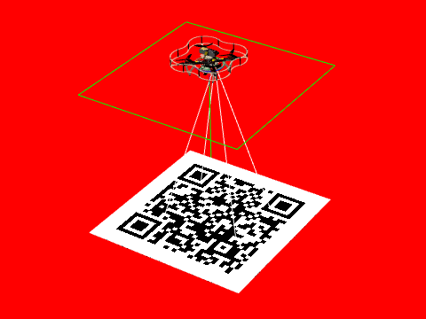

# 2. I see all



In this task copter is on invisible panel, underneath which there is qrcode and some colored background. Your goal is to say hello to server, report color of land and contents of qrcode.

1. POST request with body `hello` to `cloversim:8080/hello`
1. POST request with color of land (`red`, `green`, `blue`) to `cloversim:8080/land`
1. POST request with contents of qrcode to `cloversim:8080/qr`

## Step-by-step tutorial

### Say hello to server

Unlike previous task, we do not need to fly at all. But instead we need to report to remote server some observed data. The easiest way to do this is to use python's `request`. So let's create program and say hello to server:

```python
import requests

requests.post('http://cloversim:8080/hello', data='hello')
```

After running this program, you should get 5 points task scoring.

### Now i see

Next goal is to recognize the color of land. And to do that we need to capture frame from camera and analyze it. So let's get to work: 
1. Import libraries. We need: `rospy` - to iteract with ros; `cv2` - to analyze image; `sensor_msgs` - ros type of image; `cvbridge` - convert ros image to cv2. We we also initialize ros node and cvbrige to convert ros image to opencv image.
   ```py
   import rospy
   import cv2
   from sensor_msgs.msg import Image
   from cv_bridge import CvBridge

   rospy.init_node('computer_vision_sample')
   bridge = CvBridge()
   ```

2. Capture ros image from camera, there are multiple ways to capture images from camera and you can read more about them [there](https://clover.coex.tech/en/camera.html). But the simplest one is to to use `wait_for_message` to capture next camera frame.
   ```py
   img = bridge.imgmsg_to_cv2(rospy.wait_for_message('main_camera/image_raw', Image), 'bgr8')
   ```  

3. Analyze image. Now we need to get color of land. Simplest way is to look at one of pixels(that is not qrcode) and check which channel has max value
   ```py
   pixel = img[10, 10] # Take pixel with x=10 y=10 from top left corner
   max_chan = max(pixel) # Find the brightest channel
   color = None
   if pixel[0] == max_chan: # Map to color name
       color = 'blue'
   elif pixel[1] == max_chan:
       color = 'green'
   else:
       color = 'red'

   print(f'Detected color "{color}" from pixel {pixel}')
   ```
4. And send this to server:
   ```py
   requests.post('http://cloversim:8080/land', data=color)
   ```

### Scan qrcode
Final goal is to scan qr code. While opencv provides functions to do that, `pyzbar` is more powerfull. So we will use it
1. Import pyzbar: 
   ```py
   from pyzbar import pyzbar
   ```

2. Convert image to gray and decode it
   ```py
   gray = cv2.cvtColor(img, cv2.COLOR_BGR2GRAY)
   qrcodes = pyzbar.decode(gray)
   ```

3. Get qrcode contents and send it to server:
   ```py
   qr_data = qrcodes[0].data.decode('utf-8')
   print("Detected qrcode contents: " + qr_data)
   requests.post('http://cloversim:8080/qr', data=qr_data)
   ```

### Testing

This tasks contains some element of randomness(land color, contents of qrcode), to check that your solution works across different combinations of land color/qrcode contents, you need to:
1. Change seed, f.e. to `red`, `green`, `blue` or any other string
2. Restart simulaion to apply changes (`restart` button in WebUI or Simulator Control in IDE)
3. Run your code and check that it works

## Final code
```py
import requests
import rospy
import cv2
from sensor_msgs.msg import Image
from cv_bridge import CvBridge
from pyzbar import pyzbar

requests.post('http://cloversim:8080/hello', data='hello')

rospy.init_node('computer_vision_sample')
bridge = CvBridge()

img = bridge.imgmsg_to_cv2(rospy.wait_for_message('main_camera/image_raw', Image), 'bgr8')

pixel = img[10, 10] # Take pixel with x=10 y=10 from top left corner
max_chan = max(pixel) # Find the brightest channel
color = None
if pixel[0] == max_chan: # Map to color name
    color = 'blue'
elif pixel[1] == max_chan:
    color = 'green'
else:
    color = 'red'

print(f'Detected color "{color}" from pixel {pixel}')
requests.post('http://cloversim:8080/land', data=color)


gray = cv2.cvtColor(img, cv2.COLOR_BGR2GRAY)
qrcodes = pyzbar.decode(gray)


qr_data = qrcodes[0].data.decode('utf-8')
print("Detected qrcode contents: " + qr_data)
requests.post('http://cloversim:8080/qr', data=qr_data)
```