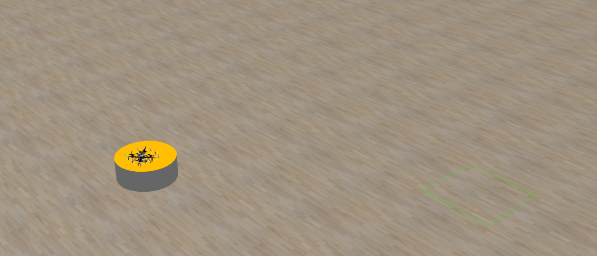
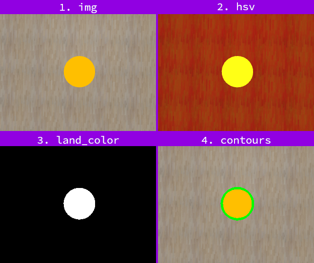

# 3. Land in the middle



This task will teach you how to land Clover in the middle of something, in this case in the middle of orange platform.

## Step-by-step tutorial

### Let's start

1. Create file where you are going to write program

2. Import required libraries, we need libraries to communicate with ros and clover services, and opencv to work with image.
   ```py
   import rospy
   from clover import srv
   from std_srvs.srv import Trigger
   from sensor_msgs.msg import Image
   from cv_bridge import CvBridge
   import cv2
   ```

3. Initialize ros node and proxy required services. In this task we will need new service called `set_velocity` it will allow us to set drone velocity instead of navigating by cordinates.
   ```py
   rospy.init_node('flight')
   bridge = CvBridge()

   get_telemetry = rospy.ServiceProxy('get_telemetry', srv.GetTelemetry)
   navigate = rospy.ServiceProxy('navigate', srv.Navigate)
   set_velocity = rospy.ServiceProxy('set_velocity', srv.SetVelocity)
   land = rospy.ServiceProxy('land', Trigger)
   ```

4. Now we need to takeoff and then we can start on landing algorithm
   ```py
   navigate(z=2, yaw=0, frame_id='body', auto_arm=True)
   rospy.sleep(5)
   ```

### Main algorithm
The idea of our algorithm of landing in the middle is following:
1. Find position of landing area on image relative to image center
2. Set clover velocity to move in direction of landing area
3. If position is close enough to image center start moving down
4. If landing area takes most of image we should call `land`

Now let's implement:
1. Let's create main loop where we are going to write this algorithm. We will use `rospy.Rate` to make this loop run 10 times a second. We will also define `target_vx`, `target_vy` and `target_vz` variables that correspond to target speed of clover. Plus we will capture image from camera and telemetry relative to map(to get altitude).
   ```py
   r = rospy.Rate(10)
   while not rospy.is_shutdown():
      target_vx = 0
      target_vy = 0
      target_vz = 0

      img = bridge.imgmsg_to_cv2(rospy.wait_for_message(
         'main_camera/image_raw', Image), 'bgr8')
   
      telemetry = get_telemetry('map')

      #### ALGORITHM GOES HERE

      print("SPEED: ", target_vx, target_vy, target_vz)
      set_velocity(vx=target_vx, vy=target_vy, vz=target_vz, frame_id='body')

      r.sleep()

   land()
   print("Landing")
   ```
2. Next we need to find landing pod on image, to do that we will turn image into hsv, do `inRange` to binarise it and then use `findContours`:
   ```py
   hsv = cv2.cvtColor(img, cv2.COLOR_BGR2HSV)
   land_color = cv2.inRange(hsv, (20, 80, 80), (40, 255, 255))

   contours, h = cv2.findContours(land_color, 1, 2)
   ```
   Here is how it looks: 

3. Now we need to find biggest contour. If there are no contours or contour is too small(false positive) we need to fly higher. And if contour is filling most of image we should exit loop and land
   ```py
   if len(contours) > 0:
      cnt = max(contours, key=cv2.contourArea)

      area = cv2.contourArea(cnt)
      if area < 100:
         target_vz = 0.1
         continue
     
      if area > 10000:
         break

      ##### Continue there
   else:
      target_vz = 0.2
   ```

4. We then find middle of contour and calculate its position relative to center of image:
   ```py
   M = cv2.moments(cnt)
   cx = int(M["m10"] / M["m00"])
   cy = int(M["m01"] / M["m00"])

   dcx = cx - img.shape[1] // 2
   dcy = cy - img.shape[0] // 2

   target_vy = -dcx * 0.01
   target_vx = -dcy * 0.01
   ```
5. And last step is to remap cordinates of center to clover speed. Also if we are closer than 10 pixels we should start movind down (the lower we are the slower we move):
   ```py

   target_vy = -dcx * 0.01
   target_vx = -dcy * 0.01

   if dcx ** 2 + dcy ** 2 < 100:
      target_vz = -telemetry.z / 8
      if target_vz > -0.1:
         target_vz = -0.1
   ```

After running this program, clover should takeoff, find and land onto orange landing pad.

You should try this program with different seeds to ensure that it works correctly for different pad positions.

## Full code

```py
import rospy
from clover import srv
from std_srvs.srv import Trigger
import math
from sensor_msgs.msg import Image
from cv_bridge import CvBridge
import cv2

rospy.init_node('flight')
bridge = CvBridge()

get_telemetry = rospy.ServiceProxy('get_telemetry', srv.GetTelemetry)
navigate = rospy.ServiceProxy('navigate', srv.Navigate)
set_velocity = rospy.ServiceProxy('set_velocity', srv.SetVelocity)
land = rospy.ServiceProxy('land', Trigger)

navigate(z=2, yaw=0, frame_id='body', auto_arm=True)
rospy.sleep(5)

r = rospy.Rate(10)
while not rospy.is_shutdown():
    target_vx = 0    
    target_vy = 0
    target_vz = 0

    telemetry = get_telemetry('map')
    
    img = bridge.imgmsg_to_cv2(rospy.wait_for_message(
        'main_camera/image_raw', Image), 'bgr8')
    

    hsv = cv2.cvtColor(img, cv2.COLOR_BGR2HSV)
    land_color = cv2.inRange(hsv, (20, 80, 80), (40, 255, 255))

    contours, h = cv2.findContours(land_color, 1, 2)
    if len(contours) > 0:
        cnt = max(contours, key=cv2.contourArea)

        area = cv2.contourArea(cnt)
        if area < 100:
            target_vz = 0.1
            continue

        if area > 10000:
            break

        M = cv2.moments(cnt)
        cx = int(M["m10"] / M["m00"])
        cy = int(M["m01"] / M["m00"])

        dcx = cx - img.shape[1] // 2
        dcy = cy - img.shape[0] // 2

        target_vy = -dcx * 0.01
        target_vx = -dcy * 0.01

        if dcx ** 2 + dcy ** 2 < 100:
            target_vz = -telemetry.z / 8
            if target_vz > -0.1:
                target_vz = -0.1
    else:
        target_vz = 0.2
    
    print("SPEED: ", target_vx, target_vy, target_vz)
    set_velocity(vx=target_vx, vy=target_vy, vz=target_vz, frame_id='body')

    r.sleep()

land()
print("Landing")

```
