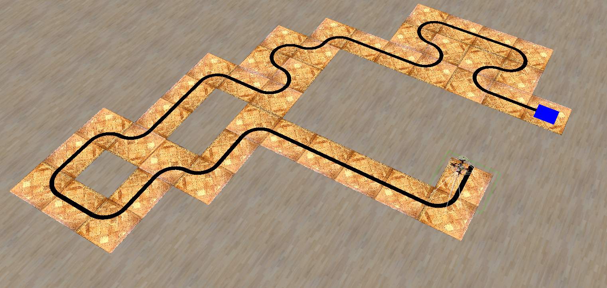

# 4. Fly by line



This task will teach you how to make clover follow line. Path consists of 40 path tiles and one finish tile(with blue squeare), although code shown in this lesson will work for more complex paths too. Path starts in positive x direction.

## Step-by-step tutorial

The idea of our algorithm of following the line:
1. Find line on the camera image
2. Recognize how much is it shifted from center and how much is it rotated. Ideally it should be straight line parallel to height axis in the middle of camera image. 
3. Fly slightly forward. Move on y axis to move line closer to center and rotate clover to make line more straight oriented.

### Getting started


1. Create file where you are going to write program

2. Import required libraries, we need libraries to communicate with ros and clover services, and opencv to work with image.
   ```py
   import rospy
   import cv2
   from clover import srv
   from std_srvs.srv import Trigger
   from sensor_msgs.msg import Image
   from cv_bridge import CvBridge
   ```

3. Initialize ros node and proxy required services. In this task we will need new service called `set_velocity` it will allow us to set drone velocity instead of navigating by cordinates.
   ```py
   get_telemetry = rospy.ServiceProxy('get_telemetry', srv.GetTelemetry)
   navigate = rospy.ServiceProxy('navigate', srv.Navigate)
   set_velocity = rospy.ServiceProxy('set_velocity', srv.SetVelocity)
   land = rospy.ServiceProxy('land', Trigger)

   rospy.init_node('flight')
   bridge = CvBridge()
   ```

4. Now we need to takeoff and then we can start on landing algorithm
   ```py   
   navigate(z=1, frame_id='body', auto_arm=True)
   rospy.sleep(10)
   ```

5. We will write main line-follow algorithm in the while loop, that will capture and process image. We will also define `target_yr` and `target_vy` that will be used later in `set_velocity`:
   ```py
   r = rospy.Rate(10)

   while not rospy.is_shutdown():
      telem = get_telemetry('map')
      img = bridge.imgmsg_to_cv2(rospy.wait_for_message('main_camera/image_raw', Image), 'bgr8')

      target_yr = 0
      target_vy = 0
   
      r.sleep()
   ```

### Line recognition

Next we need to actually detect line and understand how is it rotated(to follow line we try to keep line rotateted at 0 degress) and how far it is shifted from center(we try to keep it as low as possible):
1. Clover flies pretty high and if we process full image we will detect line on the other side f.e. To battle that we will look only in area in the center of image with sie of 80px by 76px. We will also slightly blur image to battle any line defects (blur acts as denoising):
   ```py

   h, w, d = img.shape

   img = img[
      h // 2 - 40:h // 2 + 40, 
      w // 2 - 38:w // 2 + 38
   ]
   img = cv2.blur(img, (5, 5))
   ```
2. On the end of the line we have a blue landing area, so if we see it we should land. To check if we see it we will check for B > R + G:
   ```py
    if img[60, 40, 0] > int(img[60, 40, 2]) + int(img[40, 60, 1]):
        land()
        break
   ```
3. Next we need to binarize image and find biggest contour, which is our line. We should also check that we actually selected line and not some noise by checking that area is at least 10px:
   ```py
   hsv = cv2.cvtColor(img, cv2.COLOR_BGR2HSV)
   black = cv2.inRange(hsv, (0, 0, 0), (255, 255, 80))

   contours_blk, _ = cv2.findContours(
      black.copy(), cv2.RETR_TREE, cv2.CHAIN_APPROX_SIMPLE)

   if len(contours_blk) > 0:
      cnt = max(contours_blk, key=cv2.contourArea)
      if cv2.contourArea(cnt) > 10:
         # ....
   ```
4. Now we will need to somehow understand what our line contour actually means in turn of line position relative to clover, to do that we will find `minAreaRect`. Unlike `boundingRect` that results in rectangle with sides parallel to image boundaries, `minAreaRect` will try to find rotated rectangle, so we will get position of center of line and its angle. We will also need to remap rectangle angle to angle relative to vertical axis of image. You can read more about [minAreaRect there](https://theailearner.com/tag/cv2-minarearect/):
   ```py
   rect = cv2.minAreaRect(cnt)
   (cx, cy), (w, h), angle = rect

   if w > h:
         angle = angle - 90

   if abs(angle) > 90:
         angle = 180 + angle
   ```

### Control 
Now based on information about line we need to `set_velocity` so clover will try to align to follow line.
1. Remap rectangle data to `target_yr` (yaw_rate that we will target, speed of clover rotation) from minAreaRect rotation and `target_vy` (velocity on axis y) based on distance between center of image and line:
   ```py
   target_yr = angle * (-0.05)
   target_vy = (cx - black.shape[1] // 2) * -0.005
   ```
   You can also adjust coefficients like `-0.05` and `-0.005` to make line following more smooth.

2. Now time for `set_velocity`. We will set vy and yaw_rate based on the values we got from line recognition steps, we will also move forward by setting vx to some value(the smaller the line error the faster we move). We will also maintain vz around 0.8m by setting speed based on telemtry. It's important that we use `frame_id='body'`, because without it axis on which vx and vy will not be affected by clover rotation and algorithm will break.
   ```py
   print("YAW RATE:", target_yr, "VY:", target_vy)
   set_velocity(
      vx=0.12 - abs(target_vy), 
      vy=target_vy, 
      vz=(0.8 - telem.z) * 0.3, 
      yaw=float('nan'), 
      yaw_rate=target_yr, 
      frame_id='body'
   )
   ```

Don't forget to test this code with different seeds to check that your code works on different lines.

## Full code

```py
import rospy
import cv2
from clover import srv
from std_srvs.srv import Trigger
from sensor_msgs.msg import Image
from cv_bridge import CvBridge

get_telemetry = rospy.ServiceProxy('get_telemetry', srv.GetTelemetry)
navigate = rospy.ServiceProxy('navigate', srv.Navigate)
set_velocity = rospy.ServiceProxy('set_velocity', srv.SetVelocity)
land = rospy.ServiceProxy('land', Trigger)

rospy.init_node('flight')
bridge = CvBridge()

navigate(z=1, frame_id='body', auto_arm=True)
rospy.sleep(10)

r = rospy.Rate(10)

while not rospy.is_shutdown():
    telem = get_telemetry('map')

    img = bridge.imgmsg_to_cv2(rospy.wait_for_message('main_camera/image_raw', Image), 'bgr8')
    
    target_yr = 0
    target_vy = 0

    h, w, d = img.shape

    img = img[h // 2 - 40:h // 2 + 40, w // 2 - 38:w // 2 + 38]
    img = cv2.blur(img, (5, 5))

    if img[60, 40, 0] > int(img[60, 40, 2]) + int(img[40, 60, 1]):
        land()
        break

    hsv = cv2.cvtColor(img, cv2.COLOR_BGR2HSV)
    black = cv2.inRange(hsv, (0, 0, 0), (255, 255, 80))


    contours_blk, _ = cv2.findContours(
        black.copy(), cv2.RETR_TREE, cv2.CHAIN_APPROX_SIMPLE)

    if len(contours_blk) > 0:
        cnt = max(contours_blk, key=cv2.contourArea)
        if cv2.contourArea(cnt) > 10:
            rect = cv2.minAreaRect(cnt)
            (cx, cy), (w, h), angle = rect

            if w > h:
                angle = angle - 90

            if abs(angle) > 90:
                angle = 180 + angle

            target_yr = angle * (-0.05)
            target_vy = (cx - black.shape[1] // 2) * -0.005

    print("YAW RATE:", target_yr, "VY:", target_vy)
    set_velocity(
        vx=0.12 - abs(target_vy), 
        vy=target_vy, 
        vz=(0.8 - telem.z) * 0.3, 
        yaw=float('nan'), 
        yaw_rate=target_yr, 
        frame_id='body'
    )
    r.sleep()
```
