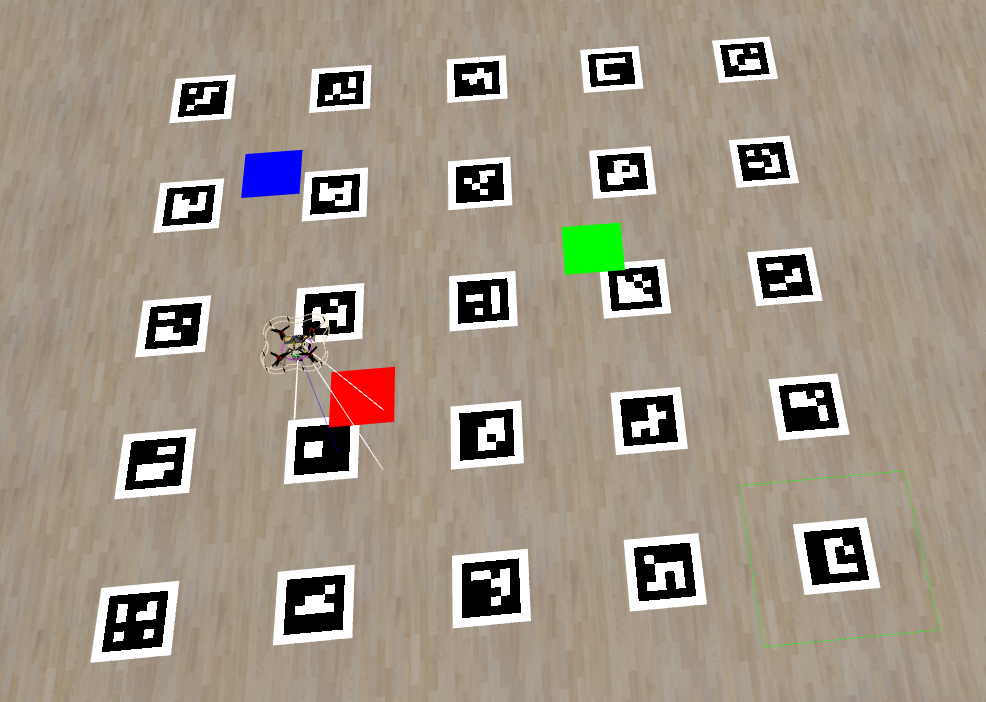

# 5. Position known



In this task you will learn how to remap points from image into real world coordinates.

The world of this task includes aruco map and three markers (red, green and blue). Your goal is to report this markers posisions to the checking server on `cloversim:8080` with post request containing json body that has object where key is color and value is array of two elements containing x and y coordinates. Example for field where red is at x=1 y=1.2, green is at x=2 y=2.2 and blue is at x=3 y=3.2:

```json
{
  "red": [1, 1.2],
  "green": [2, 2.2],
  "blue": [3, 3.2]
}
```

The max score for each marker is 20. With each centimeter your report differs you get 1 less point, if reported position is further than 20cm you get failed mark.

## Step-by-step tutorial

The algorithm that we are going to use to solve task:

1. Takeoff
2. Visit four points located at (1, 1); (1, 3); (3, 3); (3, 1), visiting them with height of z=1.2 we will be able to see whole map
3. On each point we will take and process image to determine markers positions
4. Land
5. Send determined marker positions

To process the image we will do following for each color(red, green, blue):

1. Binarize image with this color and find contour of marker
2. Simplify contours to four points. Usual contour consists of a lot of points but to correctly remap we need to get points that actually matter, in case of out markers it's 4 points that is corners of marker square.
3. Use OpenCV to [estimate position](https://docs.opencv.org/4.x/d7/d53/tutorial_py_pose.html) of marker based on cordinates of points on image. OpenCV provides set of functions that can do that, we will use `solvePnPRansac`. This function takes points of object in real life, points of object on image and camera coefficients. Using them it returns position of object relative to camera. You may see that we need to have camera coefficients, we will get them from ROS(NOTE: On real clover you will need to manually [calibrate camera](https://clover.coex.tech/en/camera_calibration.html). In cloversim camera is already calibrated)
4. Convert position relative to camera to position relative to aruco_map using tf2_ros. tf2 allows us to interact and convert different frames between each other. You are already familiar with frames for example when you call `navigate` or `get_telemetry` you specify frame_id and this frame_id is actually tf2 frame and clover will use tf2 under the hood. Now we will need to iteract with tf2 directly to convert position from frame_id `main_camera_optical` (position relative to camera) to frame_id `aruco_map` (position relative to aruco_map).

### Enable aruco map

This task provides aruco map on the ground to make flight more precise ([read more](https://clover.coex.tech/en/aruco_map.html)). To enable clover to use aruco map you need to:

1. Open `clover.launch` in editor (we will use `nano`)
   ```bash
   nano ~/catkin_ws/src/clover/clover/launch/clover.launch
   ```
2. Find arg that controls aruco, and enable it (change false to true). Like this:
   ```xml
   <arg name="aruco" default="true"/>
   ```
3. Save changes and exit nano (press `ctrl+x` then `y` then `enter`)
4. Now we need to enable aruco map and aruco detect, to do that let's open `aruco.launch`
   ```bash
   nano ~/catkin_ws/src/clover/clover/launch/aruco.launch
   ```
5. And enable args `aruco_detect` and `aruco_map` in it. Like this:
   ```xml
   <arg name="aruco_detect" default="true"/>
   <arg name="aruco_map" default="true"/>
   ```
6. Save changes and exit editor.
7. Now, because we changed clover configuration, we need to restart it. To do that press restart button in cloversim WebUI or cloversim IDE

### Getting Started

1. We will need to import a lot of libraries to complete this task:

   ```py
   import math
   import cv2
   import numpy as np
   import rospy
   from clover import srv
   from std_srvs.srv import Trigger
   from sensor_msgs.msg import Image, CameraInfo
   from geometry_msgs.msg import PoseStamped
   from cv_bridge import CvBridge
   import tf2_ros
   import tf2_geometry_msgs
   import tf.transformations
   import requests
   ```

2. Now we will initialize ROS node, CvBridge, tf2 and proxy Clover services:

   ```py
   rospy.init_node('flight')
   bridge = CvBridge()

   tf_buffer = tf2_ros.Buffer()
   tf_listener = tf2_ros.TransformListener(tf_buffer)

   get_telemetry = rospy.ServiceProxy('get_telemetry', srv.GetTelemetry)
   navigate = rospy.ServiceProxy('navigate', srv.Navigate)
   land = rospy.ServiceProxy('land', Trigger)
   ```

3. We will also need `navigate_wait` function to wait till we arrive to different points:

   ```py
   def navigate_wait(x=0, y=0, z=0, yaw=float('nan'), speed=0.5, frame_id='', auto_arm=False, tolerance=0.2):
      navigate(x=x, y=y, z=z, yaw=yaw, speed=speed,
               frame_id=frame_id, auto_arm=auto_arm)

      while not rospy.is_shutdown():
         telem = get_telemetry(frame_id='navigate_target')
         if math.sqrt(telem.x ** 2 + telem.y ** 2 + telem.z ** 2) < tolerance:
            break
         rospy.sleep(0.2)
   ```

4. Then we will define dict where we are going to store marker positions that we will then send to checker-server:

   ```py
   marker_positions = {
      "red": (0, 0),
      "green": (0, 0),
      "blue": (0, 0),
   }
   ```

5. Now we will create function that will capture and process image after we arrived to one of the points. Right now this function will juts print that we arrived to point and capture image from camera. Function has one argument `i` that indicates index of current point:

   ```py
   def process_point(i):
      rospy.sleep(2)
      print()
      print(f"=== POINT {i}")
      img_msg = rospy.wait_for_message('main_camera/image_raw', Image)
      img = bridge.imgmsg_to_cv2(img_msg, 'bgr8')
   ```

6. Time to write the code that will takeoff, navigate between points and then land us:

   ```py
   navigate_wait(z=1, auto_arm=True, frame_id='body')

   for i, point in enumerate([
      (1, 1),
      (1, 3),
      (3, 3),
      (3, 1)
   ]):
      navigate_wait(x=point[0], y=point[1], z=1.2, yaw=0, frame_id='aruco_map')
      process_point(i)

   navigate_wait(x=0, y=0, z=1, auto_arm=True, frame_id='aruco_map')
   land()

   ```

7. And finally we will send data to server:

   ```py
   print()
   print("=== FINAL DATA")
   for color, pos in marker_positions.items():
      print(f"{color}: x={pos[0]} y={pos[1]}")

   requests.post('http://cloversim:8080', json=marker_positions)
   ```

Current code after this steps:

```py
import math
import cv2
import numpy as np
import rospy
from clover import srv
from std_srvs.srv import Trigger
from sensor_msgs.msg import Image, CameraInfo
from geometry_msgs.msg import PoseStamped
from cv_bridge import CvBridge
import tf2_ros
import tf2_geometry_msgs
import tf.transformations
import requests

rospy.init_node('flight')
bridge = CvBridge()

tf_buffer = tf2_ros.Buffer()
tf_listener = tf2_ros.TransformListener(tf_buffer)

get_telemetry = rospy.ServiceProxy('get_telemetry', srv.GetTelemetry)
navigate = rospy.ServiceProxy('navigate', srv.Navigate)
land = rospy.ServiceProxy('land', Trigger)

def navigate_wait(x=0, y=0, z=0, yaw=float('nan'), speed=0.5, frame_id='', auto_arm=False, tolerance=0.2):
   navigate(x=x, y=y, z=z, yaw=yaw, speed=speed,
             frame_id=frame_id, auto_arm=auto_arm)

   while not rospy.is_shutdown():
      telem = get_telemetry(frame_id='navigate_target')
      if math.sqrt(telem.x ** 2 + telem.y ** 2 + telem.z ** 2) < tolerance:
         break
      rospy.sleep(0.2)


marker_positions = {
   "red": (0, 0),
   "green": (0, 0),
   "blue": (0, 0),
}

def process_point(i):
   rospy.sleep(2)
   print()
   print(f"=== POINT {i}")
   img_msg = rospy.wait_for_message('main_camera/image_raw', Image)
   img = bridge.imgmsg_to_cv2(img_msg, 'bgr8')

navigate_wait(z=1, auto_arm=True, frame_id='body')

for i, point in enumerate([
   (1, 1),
   (1, 3),
   (3, 3),
   (3, 1)
]):
   navigate_wait(x=point[0], y=point[1], z=1.2, yaw=0, frame_id='aruco_map')
   process_point(i)

navigate_wait(x=0, y=0, z=1, auto_arm=True, frame_id='aruco_map')
land()

print()
print("=== FINAL DATA")
for color, pos in marker_positions.items():
   print(f"{color}: x={pos[0]} y={pos[1]}")

requests.post('http://cloversim:8080', json=marker_positions)
```

You should try to run this code, to check that navigation and sendind data works correctly. You should see:

- Clover takeoff
- Flying between four points on aruco map
- Returning back and landing
- Task score updated (it will mark everything as failed, because markers are not located at 0,0)

### Processing frames

Now we will write code for `process_point` function that processes frame after arriving to some point.

1. There are markers of three different colors and we need to capture them all for every point. So first step is binarizing image to get this color. To do that we will first convert image to hsv, then shift hue by 10degrees and then call `inRange`. Why do we need to shift hue? Because to binarize red we need to inRange everything that is < 10 or > 170. But that's not easy to do with `cv2.inRange` so we will shift hue by 10 degrees so red will become 0 <= r <= 20 which easily binarized with in range. To simplify code a little we will create dict before process_point that contains mapping between color and `inRange` params:

   ```py
   markers = {
      "red": [(0, 100, 100), (20, 255, 255)],
      "blue": [(120, 100, 100), (140, 255, 255)],
      "green": [(60, 100, 100), (80, 255, 255)],
   }
   ```

   And then in `process_point` we will convert image to hsv, shift it by 10 and loop over `markers` to binarize image:

   ```py
   hsv = cv2.cvtColor(img, cv2.COLOR_BGR2HSV)
   hsv[:, :, 0] += 10
   hsv[:, :, 0] %= 180
   for color, crange in markers.items():
      bin = cv2.inRange(hsv, crange[0], crange[1])
   ```

2. Now we will find biggest contour on binarized image and check that it's not too close to image borders(to prevent half captured images from being processed). So in `process_point` function we should:

   ```py
   contours, h = cv2.findContours(bin, 1, 2)
   if len(contours) == 0:
      print(f"{color}: Not found")
      continue

   cnt = max(contours, key=cv2.contourArea)
   area = cv2.contourArea(cnt)
   if area < 100:
      print(f"{color}: Too small")
      continue

   x, y, w, h = cv2.boundingRect(cnt)
   if x < 10 or y < 10 or x+w > img.shape[1] - 10 or y+h > img.shape[0] - 10:
      print(f"{color}: Too close to borders")
      continue
   ```

3. Now that we have correct contour we need to simplify it from a lot of points to just 4 points (corners of our marker). We will do this with [contour approximation](https://docs.opencv.org/4.7.0/dd/d49/tutorial_py_contour_features.html) via approxPolyDP function:

   ```py
   epsilon = 0.1*cv2.arcLength(cnt, True)
   approx = cv2.approxPolyDP(cnt, epsilon, True).astype(np.float64)
   if len(approx) != 4:
      print(f"{color}: Invalid number of points")
      continue
   ```

4. Now we need to transform simplified contour to marker position relative to camera. To do that we will use [OpenCV Pose Estimation](https://docs.opencv.org/4.x/d7/d53/tutorial_py_pose.html) functions. But to use them we need to first get camera calibration data. This data is published in ROS topic `/main_camera/camera_info`. We will also define marker points (array of shape `4x1x3`). Marker is a square with side of 0.4, so we just need to define it's corners. Let's do that before `process_point` function:

   ```py
   camera_info = rospy.wait_for_message('main_camera/camera_info', CameraInfo)
   camera_matrix = np.array(camera_info.K).reshape((3, 3))

   marker_p = np.array([
      [[-0.2, -0.2, 0]],
      [[-0.2, 0.2, 0]],
      [[0.2, 0.2, 0]],
      [[0.2, -0.2, 0]],
   ])
   ```

   Now that we have acquired camera calibration and defined our marker we will use `solvePnPRansac` to estimate postition:

   ```py
   res, rvec, tvec, inliers = cv2.solvePnPRansac(
      marker_p, approx, camera_matrix, camera_info.D)

   if not res:
      print(f"{color}: Failed to estimate position")
      continue
   ```

   One of `solvePnPRansac` returns is `tvec` that is marker translation vector relative to camera. There is also `rvec` that is rotation but we will ignore it.

5. And the final step is to convert `tvec` to position relative to `aruco_map`. To do that we will first convert `tvec` to PoseStamped with frame_id set to `main_camera_optical` and time stamp set to time when camera frame was taken. Then we will call `tf_buffer.transform` to transform this PoseStamped relative to `main_camera_optical` to PoseStamped relative to `aruco_map`. And finally we save cords in marker_postions and print it. 
   ```py
   cam_pose = PoseStamped()
   cam_pose.header.frame_id = 'main_camera_optical'
   cam_pose.header.stamp = img_msg.header.stamp
   cam_pose.pose.position.x = tvec[0][0]
   cam_pose.pose.position.y = tvec[1][0]
   cam_pose.pose.position.z = tvec[2][0]
   cam_pose.pose.orientation.w = 1

   frame_id = 'aruco_map'
   transform_timeout = rospy.Duration(0.2)

   aruco_pose = tf_buffer.transform(cam_pose, frame_id, transform_timeout)
   print(f"{color}: x={aruco_pose.pose.position.x} y={aruco_pose.pose.position.y}")
   marker_positions[color] = (aruco_pose.pose.position.x, aruco_pose.pose.position.y)
   ```

The final code of `process_point` function:
```py
markers = {
   "red": [(0, 100, 100), (20, 255, 255)],
   "blue": [(120, 100, 100), (140, 255, 255)],
   "green": [(60, 100, 100), (80, 255, 255)],
}

camera_info = rospy.wait_for_message('main_camera/camera_info', CameraInfo)
camera_matrix = np.array(camera_info.K).reshape((3, 3))

marker_p = np.array([
   [[-0.2, -0.2, 0]],
   [[-0.2, 0.2, 0]],
   [[0.2, 0.2, 0]],
   [[0.2, -0.2, 0]],
])

def process_point(i):
   rospy.sleep(2)
   print()
   print(f"=== POINT {i}")
   img_msg = rospy.wait_for_message('main_camera/image_raw', Image)
   img = bridge.imgmsg_to_cv2(img_msg, 'bgr8')
   hsv = cv2.cvtColor(img, cv2.COLOR_BGR2HSV)
   hsv[:, :, 0] += 10
   hsv[:, :, 0] %= 180
   for color, crange in markers.items():
      bin = cv2.inRange(hsv, crange[0], crange[1])

      contours, h = cv2.findContours(bin, 1, 2)
      if len(contours) == 0:
         print(f"{color}: Not found")
         continue

      cnt = max(contours, key=cv2.contourArea)
      area = cv2.contourArea(cnt)
      if area < 100:
         print(f"{color}: Too small")
         continue

      x, y, w, h = cv2.boundingRect(cnt)
      if x < 10 or y < 10 or x+w > img.shape[1] - 10 or y+h > img.shape[0] - 10:
         print(f"{color}: Too close to borders")
         continue

      epsilon = 0.1*cv2.arcLength(cnt, True)
      approx = cv2.approxPolyDP(cnt, epsilon, True).astype(np.float64)
      if len(approx) != 4:
         print(f"{color}: Invalid number of points")
         continue

      res, rvec, tvec, kkk = cv2.solvePnPRansac(
         marker_p, approx, camera_matrix, camera_info.D)
      
      if not res:
         print(f"{color}: Failed to estimate position")
         continue

      cam_pose = PoseStamped()
      cam_pose.header.frame_id = 'main_camera_optical'
      cam_pose.header.stamp = img_msg.header.stamp
      cam_pose.pose.position.x = tvec[0][0]
      cam_pose.pose.position.y = tvec[1][0]
      cam_pose.pose.position.z = tvec[2][0]
      cam_pose.pose.orientation.w = 1

      frame_id = 'aruco_map'
      transform_timeout = rospy.Duration(0.2)

      aruco_pose = tf_buffer.transform(cam_pose, frame_id, transform_timeout)
      print(f"{color}: x={aruco_pose.pose.position.x} y={aruco_pose.pose.position.y}")
      marker_positions[color] = (aruco_pose.pose.position.x, aruco_pose.pose.position.y)
```

### Test program

Now you can check whole program, after clover have landed you should see that you got around 55 points. This can be improved, f.e. you can capture multiple frames at each point and calculate average position. But for purposes of learning it is good enough score. Also, don't forget to test your code on different seeds.

## Full code

```py
import math
import cv2
import numpy as np
import rospy
from clover import srv
from std_srvs.srv import Trigger
from sensor_msgs.msg import Image, CameraInfo
from geometry_msgs.msg import PoseStamped
from cv_bridge import CvBridge
import tf2_ros
import tf2_geometry_msgs
import tf.transformations
import requests

rospy.init_node('flight')
bridge = CvBridge()

tf_buffer = tf2_ros.Buffer()
tf_listener = tf2_ros.TransformListener(tf_buffer)

get_telemetry = rospy.ServiceProxy('get_telemetry', srv.GetTelemetry)
navigate = rospy.ServiceProxy('navigate', srv.Navigate)
land = rospy.ServiceProxy('land', Trigger)

def navigate_wait(x=0, y=0, z=0, yaw=float('nan'), speed=0.5, frame_id='', auto_arm=False, tolerance=0.2):
   navigate(x=x, y=y, z=z, yaw=yaw, speed=speed,
          frame_id=frame_id, auto_arm=auto_arm)

   while not rospy.is_shutdown():
      telem = get_telemetry(frame_id='navigate_target')
      if math.sqrt(telem.x ** 2 + telem.y ** 2 + telem.z ** 2) < tolerance:
         break
      rospy.sleep(0.2)

marker_positions = {
   "red": (0, 0),
   "green": (0, 0),
   "blue": (0, 0),
}

markers = {
   "red": [(0, 100, 100), (20, 255, 255)],
   "blue": [(120, 100, 100), (140, 255, 255)],
   "green": [(60, 100, 100), (80, 255, 255)],
}

camera_info = rospy.wait_for_message('main_camera/camera_info', CameraInfo)
camera_matrix = np.array(camera_info.K).reshape((3, 3))

marker_p = np.array([
   [[-0.2, -0.2, 0]],
   [[-0.2, 0.2, 0]],
   [[0.2, 0.2, 0]],
   [[0.2, -0.2, 0]],
])

def process_point(i):
   rospy.sleep(2)
   print()
   print(f"=== POINT {i}")
   img_msg = rospy.wait_for_message('main_camera/image_raw', Image)
   img = bridge.imgmsg_to_cv2(img_msg, 'bgr8')
   hsv = cv2.cvtColor(img, cv2.COLOR_BGR2HSV)
   hsv[:, :, 0] += 10
   hsv[:, :, 0] %= 180
   for color, crange in markers.items():
      bin = cv2.inRange(hsv, crange[0], crange[1])

      contours, h = cv2.findContours(bin, 1, 2)
      if len(contours) == 0:
         print(f"{color}: Not found")
         continue

      cnt = max(contours, key=cv2.contourArea)
      area = cv2.contourArea(cnt)
      if area < 100:
         print(f"{color}: Too small")
         continue

      x, y, w, h = cv2.boundingRect(cnt)
      if x < 10 or y < 10 or x+w > img.shape[1] - 10 or y+h > img.shape[0] - 10:
         print(f"{color}: Too close to borders")
         continue

      epsilon = 0.1*cv2.arcLength(cnt, True)
      approx = cv2.approxPolyDP(cnt, epsilon, True).astype(np.float64)
      if len(approx) != 4:
         print(f"{color}: Invalid number of points")
         continue

      res, rvec, tvec, kkk = cv2.solvePnPRansac(
         marker_p, approx, camera_matrix, camera_info.D)
      
      if not res:
         print(f"{color}: Failed to estimate position")
         continue

      cam_pose = PoseStamped()
      cam_pose.header.frame_id = 'main_camera_optical'
      cam_pose.header.stamp = img_msg.header.stamp
      cam_pose.pose.position.x = tvec[0][0]
      cam_pose.pose.position.y = tvec[1][0]
      cam_pose.pose.position.z = tvec[2][0]
      cam_pose.pose.orientation.w = 1

      frame_id = 'aruco_map'
      transform_timeout = rospy.Duration(0.2)

      aruco_pose = tf_buffer.transform(cam_pose, frame_id, transform_timeout)
      print(f"{color}: x={aruco_pose.pose.position.x} y={aruco_pose.pose.position.y}")
      marker_positions[color] = (aruco_pose.pose.position.x, aruco_pose.pose.position.y)


navigate_wait(z=1, auto_arm=True, frame_id='body')

for i, point in enumerate([
   (1, 1),
   (1, 3),
   (3, 3),
   (3, 1)
]):
   navigate_wait(x=point[0], y=point[1], z=1.2, yaw=0, frame_id='aruco_map')
   process_point(i)

navigate_wait(x=0, y=0, z=1, auto_arm=True, frame_id='aruco_map')
land()

print()
print("=== FINAL DATA")
for color, pos in marker_positions.items():
   print(f"{color}: x={pos[0]} y={pos[1]}")

requests.post('http://cloversim:8080', json=marker_positions)
```
